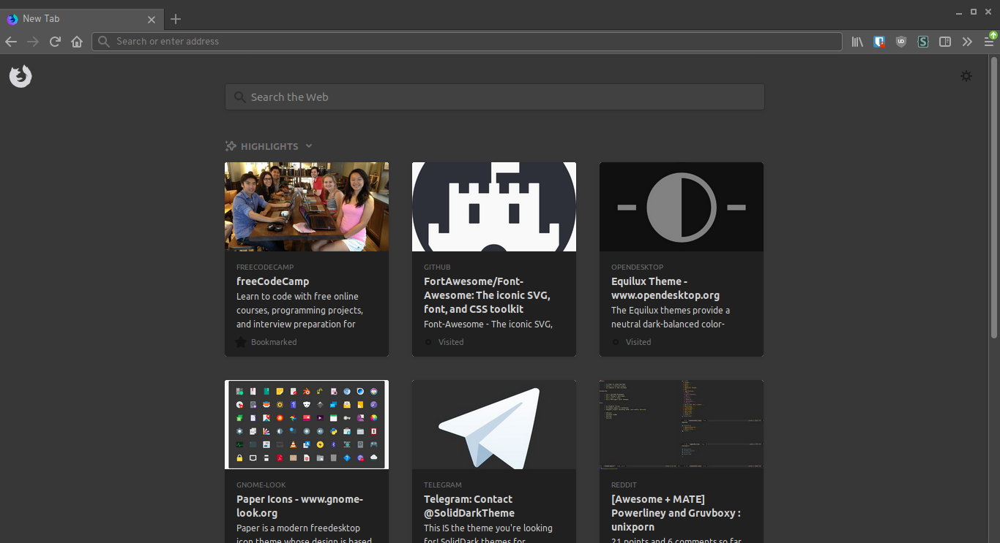

# Equilux-Firefox
An Equilux color scheme for Firefox userContent.css and userChrome.css. 
The theme changes the background color for the new tab page and removes the white background on page load.

## Using Equilux-Firefox

1. Clone or download repository.
2. In the firefox address bar, go to about:profiles and 'Open Directory' of your used profile.
3. Create a 'chrome' folder if it doesn't exist.
4. Extract and copy userChrome.css and userContent.css into the folder.

Note: If the chrome folder along with userChrome.css and userContent.css already exists, you can copy the repo's userChrome and userContent code and append it.
